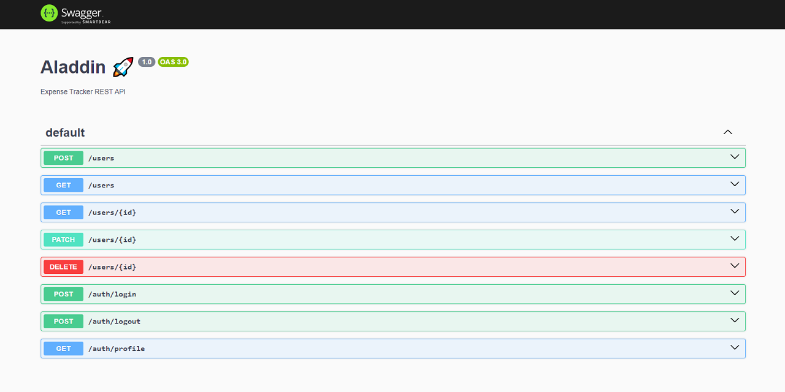

# Aladdin

🚀 Expense Tracker REST API - NestJS + Prisma

[](https://www.typescriptlang.org/docs/handbook/2/everyday-types.html)
[](https://www.prisma.io/docs/orm/overview/introduction/what-is-prisma)
[](https://docs.nestjs.com/first-steps)

<!-- 


 -->


## Setup

```bash
$ git clone https://github.com/2gbeh/aladdin.git

$ cd aladdin

# npm cache clean --force
# npm install --legacy-peer-deps
$ npm install

$ npm run start:dev

# http://127.0.0.1:3000
```

## API Docs

Visit https://aladdin-p20y.onrender.com/

## Screenshot(s)


