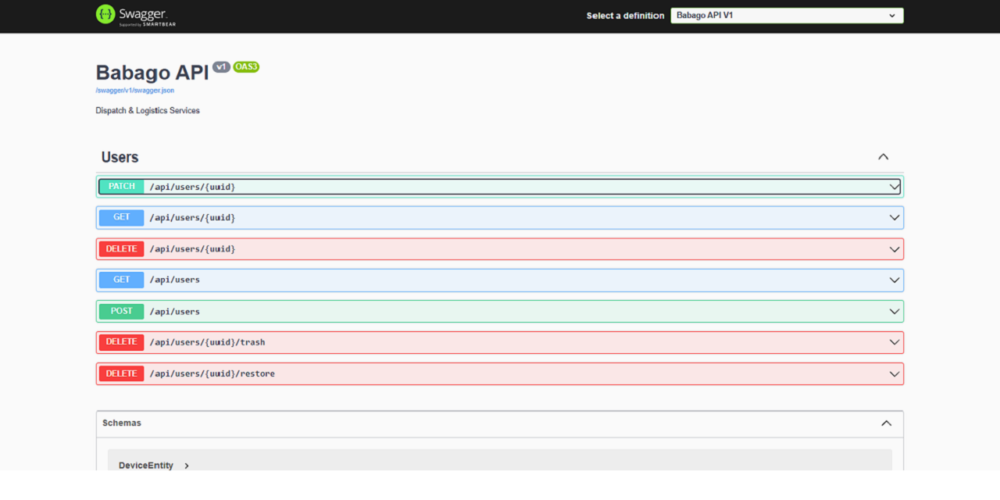

# Ctor

Dispatch & Logistics Services | Babago API

[](https://learn.microsoft.com/en-us/dotnet/csharp/tour-of-csharp/overview)
[](https://learn.microsoft.com/en-us/aspnet/core/tutorials/min-web-api?view=aspnetcore-9.0&tabs=visual-studio)
[](https://www.w3schools.com/mysql/default.asp)


## Setup

```bash
# Clone repository
git clone https://github.com/2gbeh/Ctor.git
cd Ctor
code .

# Restore dependencies
dotnet restore

# Run database migration
dotnet ef database update

# Troubleshoot database migration
dotnet tool install --global dotnet-ef

# Run web server
dotnet watch run
> http://localhost:5288/swagger
```

## Documentation

| Title                                        | URL                                                                                                         |
| :------------------------------------------- | :---------------------------------------------------------------------------------------------------------- |
| C# Tutorial                                  | https://www.w3schools.com/cs/index.php                                                                      |
| Web API .NET 6 2022 (Teddy Smith)            | https://www.youtube.com/playlist?list=PL82C6-O4XrHdiS10BLh23x71ve9mQCln0                                    |
| REST APIs in .NET 9 (freeCodeCamp.org)       | https://www.youtube.com/watch?app=desktop&v=38GNKtclDdE                                                     |
| Getting Started with Minimal API             | https://learn.microsoft.com/en-us/training/modules/build-web-api-minimal-api/?WT.mc_id=dotnet-35129-website |
| Intro to Web API in .NET 6 (IAmTimCorey)     | https://www.youtube.com/watch?app=desktop&v=87oOF9Ve-KA                                                     |
| Minimal API in .NET 6 - Part 2 (IAmTimCorey) | https://www.youtube.com/watch?app=desktop&v=5tYSO5mAjXs                                                     |

## Screenshots


